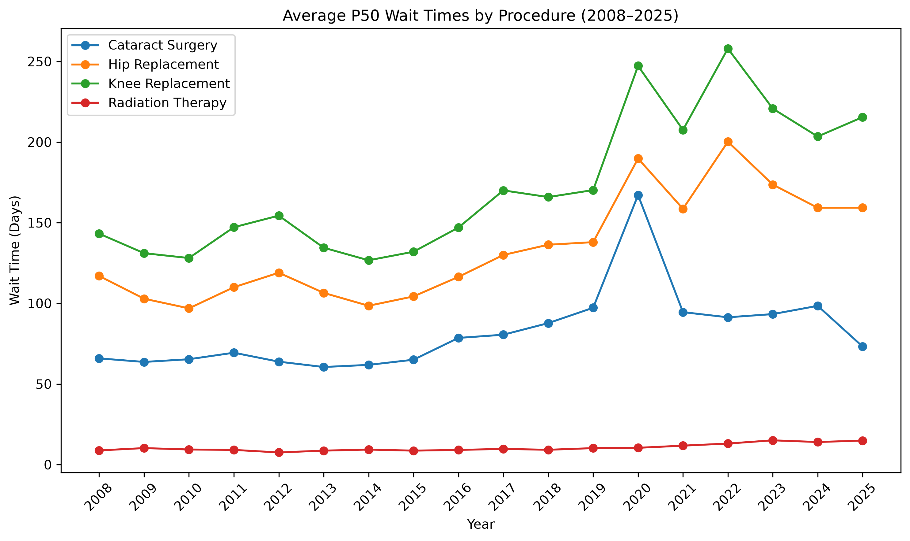
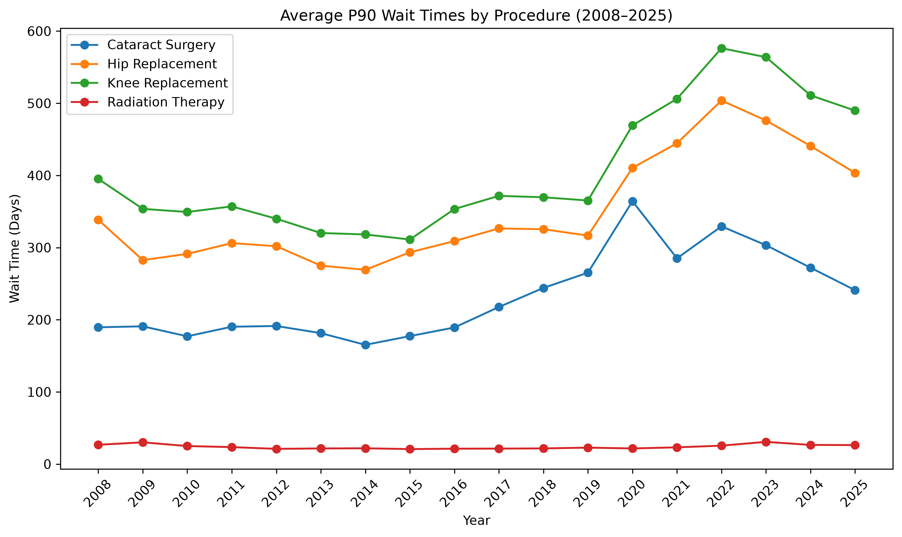
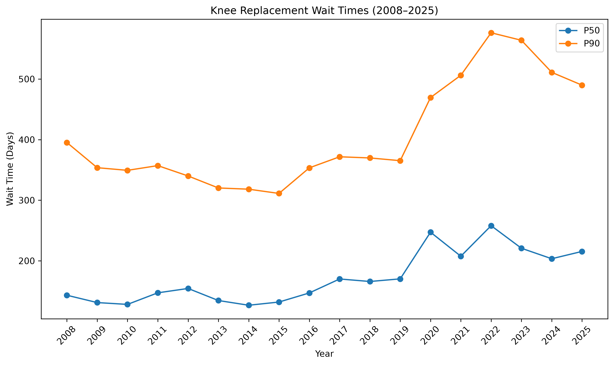

# Canadian Healthcare Wait Times Analysis (2008–2025)

## Project Overview

This project analyzes healthcare wait-time trends for priority medical procedures across Canadian provinces from 2008 to 2025.

The analysis focuses on four procedures:

- Cataract Surgery
- Hip Replacement
- Knee Replacement
- Radiation Therapy

Wait-time performance is evaluated using median (P50) wait times, 90th percentile (P90) wait times, benchmark achievement rates, and procedure volumes.

The project examines long-term trends, differences across procedures and provinces, and changes observed across the pre-COVID, pandemic, and recovery periods.

## Research Questions

1. How have wait times for priority medical procedures changed across Canadian provinces from 2008 to 2025?
2. Which procedures show the greatest deterioration or improvement in wait-time performance?
3. How did wait-time patterns differ between the pre-COVID (2008–2019), pandemic (2020–2022), and recovery (2023–2025) periods?

## Tools & Technologies

- Python
- pandas
- NumPy
- Matplotlib
- SciPy
- Jupyter Notebook
- Excel / openpyxl

## Dataset

The analysis uses publicly available wait-time data from the Canadian Institute for Health Information (CIHI), covering priority medical procedures across Canadian provinces from 2008 to 2025.

The dataset includes:

- Median (P50) wait times
- 90th percentile (P90) wait times
- Percentage of procedures completed within benchmark
- Procedure volumes

The raw dataset is not included in this repository. Instructions for obtaining and organizing the data are provided in the `data/` directory.

## Methodology

The analysis was conducted in Python using pandas for data preparation and aggregation, Matplotlib for visualization, and SciPy for simple linear trend analysis.

The main analytical steps included:

1. Cleaning and filtering annual provincial data from 2008 to 2025.
2. Comparing P50 and P90 wait-time trends across four priority procedures.
3. Measuring changes in wait times and benchmark achievement between 2008 and 2025.
4. Conducting a detailed analysis of Knee Replacement wait times, including provincial differences and procedure volumes.
5. Comparing wait-time performance across the pre-COVID (2008–2019), pandemic (2020–2022), and recovery (2023–2025) periods.
6. Using simple linear regression to evaluate long-term trends in P50 and P90 wait times.

Provincial averages are descriptive averages across available provincial observations and should not be interpreted as official CIHI national estimates.

## Key Findings

### 1. Knee Replacement showed the strongest deterioration

Among the four procedures analyzed, Knee Replacement showed the largest increase in median wait time between 2008 and 2025.

- P50 wait time increased by approximately **50.5%**.
- P90 wait time increased by approximately **23.9%**.
- Benchmark achievement decreased by approximately **16.9 percentage points**.

This indicates that both typical and longer-wait cases worsened over the study period, while a smaller share of procedures were completed within the benchmark.

### 2. Wait-time deterioration was visible across multiple procedures

Cataract Surgery, Hip Replacement, and Knee Replacement all showed increases in both P50 and P90 wait times between 2008 and 2025.

Long-term linear trend analysis also identified statistically significant increasing trends in P50 wait times for all four procedures. For P90 wait times, Cataract Surgery, Hip Replacement, and Knee Replacement showed significant increasing trends, while Radiation Therapy did not show a statistically significant linear trend.

### 3. The pandemic period coincided with substantial deterioration

Knee Replacement showed particularly large changes during the pandemic period (2020–2022) compared with the pre-COVID period (2008–2019):

- Average P50 wait time increased by approximately **62.9%**.
- Average P90 wait time increased by approximately **47.6%**.
- Benchmark achievement decreased by approximately **23.4 percentage points**.

During the recovery period (2023–2025), median wait times and benchmark performance partially improved. However, P90 wait times remained close to pandemic-period levels, suggesting that longer-wait cases remained elevated.

## Visualizations

### P50 Wait-Time Trends



Median wait times generally increased over the study period, with Knee Replacement showing the largest long-term deterioration.

### P90 Wait-Time Trends



P90 wait times increased substantially for Cataract Surgery, Hip Replacement, and Knee Replacement, highlighting growing delays among longer-wait cases.

### Knee Replacement Deep Dive



Knee Replacement shows a clear increase in both P50 and P90 wait times, with a particularly sharp rise beginning around 2020. Although median wait times declined from their pandemic-period peak, P90 wait times remained elevated.

## Limitations

This analysis has several limitations that should be considered when interpreting the results:

- Data availability varies across provinces, years, procedures, and metrics. Missing observations were excluded rather than imputed.
- Provincial averages are simple averages across available provincial observations and are not equivalent to official CIHI national estimates, which may use different aggregation methods.
- The pre-COVID, pandemic, and recovery periods contain different numbers of years, so comparisons between period averages should be interpreted cautiously.
- The term "recovery" refers to the 2023–2025 analysis period and does not imply that wait-time performance fully returned to pre-COVID levels.
- Linear regression was used to describe long-term trends and does not establish causal relationships.
- The analysis does not control for factors such as population growth, healthcare capacity, demographics, case complexity, or changes in reporting practices.

## Repository Structure

```text
Canada-Healthcare-Wait-Times/
├── README.md
├── requirements.txt
├── .gitignore
├── data/
│   └── README.md
├── figures/
│   ├── procedure_p50_trends.png
│   ├── procedure_p90_trends.png
│   └── knee_replacement_trends.png
└── notebooks/
    └── 01_wait_times_analysis.ipynb
```

- `notebooks/` contains the complete data analysis.
- `figures/` contains selected visualizations used in this README.
- `data/README.md` provides instructions for obtaining and organizing the source dataset.
- `requirements.txt` lists the Python packages required to run the analysis.

## How to Run

1. Clone this repository:

```bash
git clone https://github.com/Podang0420/Canada-Healthcare-Wait-Times.git
cd Canada-Healthcare-Wait-Times
```

2. Install the required Python packages:

```bash
pip install -r requirements.txt
```

3. Download the CIHI wait-time dataset and place the Excel file at:

```text
data/Raw Data/wait-times-priority-procedures-in-canada-2008-2025-data-tables-en.xlsx
```

4. Open and run:

```text
notebooks/01_wait_times_analysis.ipynb
```

Run the notebook from top to bottom to reproduce the analysis and visualizations.

## Conclusion

This project examined long-term healthcare wait-time trends across Canadian provinces from 2008 to 2025 using multiple measures of system performance.

Overall, the analysis found that wait-time performance generally worsened over the study period, with Knee Replacement showing the clearest combination of increasing median and longer-wait times and declining benchmark achievement.

The pandemic period coincided with substantial deterioration in several wait-time measures. While some indicators showed improvement during 2023–2025, the recovery was uneven. In particular, longer-wait Knee Replacement cases remained elevated relative to the pre-COVID period.

These findings highlight the importance of evaluating healthcare wait times using multiple measures, including P50, P90, benchmark achievement, and procedure volume, rather than relying on a single indicator.
